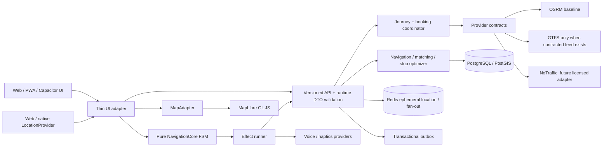

# MARSHGO — Production Integration Plan

Дата базового зрізу: 2026-09-30. Джерело стану: [PRODUCTION_READINESS_REVIEW_2026-09-30.md](PRODUCTION_READINESS_REVIEW_2026-09-30.md). Дизайн і екранні acceptance criteria: [DESIGN_INTEGRATION_MATRIX.md](DESIGN_INTEGRATION_MATRIX.md).

Цей план є послідовністю завершення чинного продукту. Це не доказ готовності, календарна обіцянка, дозвіл на production deployment чи заміна коду. Поточний висновок: Foundation **не frozen**, Gate A **не release-ready**, Gate B **blocked by external provider agreements/data**.

## 1. Модель завершення

MARSHGO лишається модульним монолітом із трьома клієнтськими/серверними репозиторіями. Реалізовані Offers, Bookings, Proposals, Navigation matching, Journey, Redis outbox/inbox та Rendezvous залишаються доменними системами-джерелами. Навігаційне ядро приймає події та видає effects; адаптери виконують мережу/GPS/рендеринг. Спільний Journey coordinator оркеструє перевірені legs, але ціна, місця, згоди, учасники, маршрутна версія та завершення бронювання залишаються серверними рішеннями.

**Основні контракти** — єдині схеми у версійному API: `LocationFix`, `RouteRequest`, canonical `RouteResult` із polyline6, `NavigationState`, `NavigationEvent`, typed `NavigationError`, `Ownership`, versioned `DomainEvent`. На межах HTTP/provider/WebSocket/config виконуються runtime schemas. Нові optional fields сумісні з `/api/v1`; зміна semantics або вилучення поля потребує `/api/v2`. Старий GeoJSON/route arrays підтримуються до міграції всіх клієнтів і завершення періоду сумісності.

**Незмінні правила:** MapLibre відображає, не приймає доменні рішень. Core без React/DOM/provider/network side effects. OSRM/NoTraffic є базовим режимом. Зовнішній inventory не створюється fixtures. У стратегіях Journey немає commission/payout. Offline вимикає нове бронювання, passenger matching і live traffic. Жодна платна дія/заміна Journey не відбувається без явного підтвердження. Raw GPS не потрапляє в durable outbox, звичайні логи чи history за замовчуванням.

## 2. Послідовність та вихідні критерії

Кожен етап має окрему логічну гілку/commit, оновлення progress/checklist, reviewable diff і тести. Після кожного merge/rebase звірити актуальні `main`, dependency SHA і повний CI. Інтеграційні міграції запускати лише на ізольованій локальній/стейджинговій БД із явним URL; жодних production міграцій у цьому плані.

### Phase 0 — репозиторії та release baseline

**Зробити:** синхронізувати роботу з актуальними upstream PR/main без втрати незакомічених змін; визначити власника кожного модуля між Server/Site/iOS; узгодити Node 24.21/Bun lockfile, release branch і changelog; додати architecture decision records для frozen контрактів. Розширити lint на всі source/shared modules та Server standalone. Зафіксувати `main` baseline build, unit, PostGIS/Redis integration, Playwright, bundle report, Pro Max simulator build.

**Перевірки:** чисті контрольовані дерева; `bun install --frozen-lockfile`; Server/Site/umbrella checks; міграції 001–023 з нуля на ізольованій PostGIS; `test:integration`; E2E; pinований Node; current-site-SHA iOS Simulator compile.

**Готово коли:** головні refs і PR залежності записані, CI має повну відтворювану стартову точку, у progress немає розбіжності «реалізовано» проти checklist. Це ще не release.

### Phase 1 — contract freeze candidate, помилки та API сумісність

**Зробити:** доробити Foundation WIP замість паралельного другого шару: runtime schemas/типи, coordinates як `[longitude,latitude]`, canonical `RouteResult`, bounded polyline6 codec, bounds, maneuvers, `NavigationError`, API DTO, Ownership/actor та event envelope. Побудувати OpenAPI для наявної `/api/v1` поверх фактичних handlers. Перевірити запит, відповідь і WebSocket за схемою. Зберегти сумісні overloads старих route масивів і нормалізувати тільки всередині boundary adapter.

**Рішення перед реалізацією:** чи за wire format для маршруту відповідає API v1 чи окреме optional поле; route version ownership; поведінка невідомих enum; payload-size ceiling. Canonical schema не можна називати `frozen`, доки нема contract compatibility tests з попереднім клієнтом.

**Готово коли:** OpenAPI і generated/checked DTO відображають endpoints; invalid/stale/oversized payload-и відхиляються; старий мобільний bundle читає актуальну відповідь; typed `code/requestId` зберігаються в клієнті.

### Phase 2 — OSRM Provider та server boundaries

**Зробити:** обгорнути нинішній fetch у `OsrmRoutingProvider`; profile/capabilities/health, timeout, один обмежений retry лише на safe operation, request id, canonical errors. Віддати старі `getRoadRoute*` через compatibility facade. Перенести routing endpoints із `server/index.ts` лише після contract tests; поступово розділяти handlers на маршрути, не робити rewrite всіх 3.5k рядків. Реалізувати config alias `OSRM_URL || ROUTING_ENGINE_URL`, перевірити prod TLS/non-local URL та disabled provider fail-closed. Зберегти поведінку багатоточкового OSRM і перевірити правильний vehicle profile.

**Критерії:** local OSRM fixture, недоступний/повільний/429/bad JSON/NoRoute/wrong geometry/waypoints/profile tests. У відповіді baseline чесно має `trafficAware=false`, `durationWithoutTrafficSeconds=durationSeconds`, `confidence=BASELINE`. HERE/TomTom вимкнені, ключі серверні; для Foundation достатньо contract/NoTraffic, paid adapter не активувати.

### Phase 3 — NavigationCore та location pipeline

**Зробити:** чистий, serializable reducer `transition(state,event)`: IDLE→PLANNING→ACTIVE/PAUSED/OFFLINE/REROUTING/ARRIVED/ENDED/ERROR. У reducer немає fetch/clock/global/browser imports. Відділити `LocationProvider`, `LocationController`, GPS pipeline (schema → accuracy → freshness → time-order → impossible jump/speed → smoothing/map-match extension). Серверний timestamp є authority; clock skew не маскується. `NavigationEffectRunner` виконує effect та повертає event. Винести throttle/server-sync із UI: камера/маркер оновлюються локально, sync rate та умови залишаються окремою політикою.

**Offline/degraded:** кешувати route/version, maneuvers, stops/destination, останній matched fix і обмежену потрібну map region локально з приватним TTL; не кешувати бронювання як підтверджені або відкритий профіль/чужі координати. Network loss ставить DEGRADED/OFFLINE, зберігає доступний route progress, показує застарілий ETA як stale; matching, booking і traffic зупиняються. Reconnect спершу звіряє server session/routeVersion, а не завантажує локальне припущення назад у shared state.

**Критичне узгодження:** закінчення точного GPS storage після TTL не завершує route/session. Створити TTL окремо для last precise point/Redis; route/session зберігається доки продуктова політика дозволяє resume, із bounded expiry та завершенням власником/серверною політикою. Після завершення активного сценарію чистяться локальний кеш, серверна точка і ephemeral Redis keys; продумати sign-out/account switch. Визначити backup retention і post-restore повторне видалення.

**Готово коли:** NavigationCore/State/Event/error мають pure transition tests і перевірку заборонених imports; location permissions/errors типізовані; frontend UI лише представляє state й запускає adapter/effects; local marker не залежить від API RTT.

### Phase 4 — GPS Replay та behavioral baseline

**Зробити:** CLI у `tools/navigation-replay`, JSONL fixtures: clean urban, highway, weak accuracy, tunnel/no-fix, urban canyon, jump/teleport, wrong heading, off-route/return, passenger insertion, multi-stop, offline/reconnect. Кожна fixture має deterministic timestamps/clock injection і golden output: accepted fixes, matched confidence, off-route intervals, reroutes/cooldown, routeVersion, stop progression/arrival, ETA error. Не включати персональні/raw реальні дані без анонімізації/consent.

**Контроль:** fuzzy tolerances задокументовані; test не вимагає і не заявляє real road map matching, якщо fixture містить тільки симуляцію/provider fake. Додати базові агреговані метрики accuracy/age/error/duration без координат. Реальну анонімізовану трасу додати лише після підтвердженого дозволу/підготовки даних; інакше gate позначити blocked external/data.

### Phase 5 — MapLibre adapter, style та дизайн-система

**Зробити:** окремий lazy chunk `src/map` із `MapAdapter`, `MapLibreAdapter`, `MarshGoMap`, `NavigationCameraController`, source/layer modules для route/traffic/incidents/vehicle/waypoints. `ProductionNavigation` передає DTO і callbacks, не імпортує Leaflet/MapLibre. Замість глобального map object map adapter має lifecycle, resize, safe destroy, typed update, source reload і camera command. Динамічні marker/accessibility controls поза canvas лише як UI layer.

Map style як TypeScript source/tokens → зібраний JSON → runtime schema validation + structural snapshot. Варіанти `MARSHGO_LIGHT/DARK/NAVIGATION_LIGHT/DARK`, style ID/version та manifest; layer names/zoom/filter/attribution узгоджені з реальним vector tileset. PMTiles протокол lazy-register, URL immutable. 3D buildings вмикати тільки якщо source реально має building/height data; fallback без помилок. Traffic/incident sources порожні і вимкнені доки є NoTraffic.

**Карти acceptance:** ніяких OSM public raster/Esri/CARTO endpoints у production. Без style/data service UI чесно показує route на empty background і повідомляє, що базова карта не налаштована; маршрутна лінія не імітує вулиці. Local test style/PBF/archive фікстура для browser visual regression. `route`, GPS pointer, bearing, pitch, fit, manual pan→FREE, recenter→FOLLOW_HEADING, reduce motion, dark/light і error/retry перевірити у Playwright + iOS.

**Блокер:** MAP_STYLE_MANIFEST_URL / MAP_DATA_MANIFEST_URL мають вести на реально розгорнуті та ліцензовані OSM-derived PMTiles/CDN (Planetiler pipeline, range/CORS/HTTPS, immutable version, glyphs/sprites/fonts/attribution, Ukraine coverage). Успішний локальний mock не доводить production basemap. Не підставляти публічний demo style у production.

**Готово коли:** map lazy gzip contribution виміряний у затвердженому бюджеті; runtime style валідний; одна map implementation у production; tile failures видно в telemetry; реальні вулиці відображаються на staging/пристрої.

### Phase 6 — thin ProductionNavigation і реальний route execution

**Зробити:** інтерфейсний екран оркеструє core/store, location, API, map та підтверджені driver match actions. Зберегти opt-in, pause-before-response, account/vehicle checks, пояснення foreground-only. Локальний fix з’являється за <500 ms без очікування API, але server-reconciled routeVersion/waypoint має пріоритет. Зміна destination через typed lookup, start/recover/end, idempotent route request, stale fix banner, м’який reroute/hysteresis. Maneuvers локалізує `GuidanceFormatter`, provider текст не показується напряму. Voice/Haptics мають працездатний local/unsupported provider state. Під час MOVING кандидат відображається коротко і не відкриває складну дію; відповідати можна лише після безпечної зупинки.

**Готово коли:** E2E start→GPS→road route→pause→resume→route update→end, network loss/reconnect, invalid/no permission/GPS stale, server conflict та unauthorized cases; external route engine URL налаштований лише у staging environment.

### Phase 7 — stop optimization, matching, shared lifecycle hardening

**Зробити:** описати stop domain (кожний booking має pickup/dropoff, windows, seats, state), розділити прибуття, explicit boarding і dropoff. Оптимізатор рахує baseline+shortlisted road insertion, зобов’язання кожного booking, порядок pickup≤dropoff, capacity по кожному segment, dwell, ETA windows, route version, driver limits і detour time (ранжування за time). Перерахунок усіх stop/deallocation/cancel та seat lifecycle — одна транзакція з advisory/row locks, audit/outbox. Browser candidate не створює booking до обох сторін/ціни й explicit passenger accept.

**Рандомні realtime duplicates:** outbox event envelope має event UUID/type/schema/aggregate/version/occurredAt/payload; існуючий outbox лишається transactionally durable, at-least-once. Consumer idempotency/aggregate ordering/resync-from-DB. Ephemeral precise updates не виходять у durable outbox або inbox. Розв’язати R18 cancellation recipient defect перед live notifications.

**Готово коли:** 20-way final seat; acceptance/cancel retries; double passenger; multi-stop on-board route; changed snapshot conflict; double ordering GPS; blocks/suspended accounts/vehicle invalidation; passager boarding no auto. Серверний matching integration+PostGIS та multi-instance Redis E2E.

### Phase 8 — Rendezvous та приватність

**Зробити:** виправити перевірене state transition defect R15: зберігати дві незалежні actor states/timestamps; проєкція derived state стає BOTH_NEARBY для будь-якого порядку, delay не повертає arrived назад. Atomic versioned latest-location update + authorization recheck під час update, Redis TTL max 5 min, cancel/boarding/revoke consent чистять обидві точки. GPS accuracy може лише підказати “ви близько”; явна дія лишається джерелом статусу. Зробити двостороннє підтвердження посадки/QR fallback і лише після цього переходити до booked ride lifecycle. GET не створює session side effect; activation — за booking/lead/учасником; визначити поведінку після завершення/відміни.

Зв’язати з ETA engine: routing provider рахує окремі driver→pickup та passenger→pickup, прогноз READY AT = max обґрунтованих ETA, freshness/accuracy та routeVersion. Підтримати last known stale й текст “не оновлюється”; не показувати fabricated ETA. Прийняті start/boarding event змінюють шлях тільки через authorized server lifecycle.

**Privacy matrix** для raw fix, matched point, rendezvous point, booking pickup, journey location, anonymized traffic: мета, owner/access, storage, retention, deletion trigger/worker, metric, audit, backup expiry/reapply after restore. Застосувати до DB, Redis, logs, browser cache, push payloads і backups.

**Готово коли:** два окремі accounts/browser, state transitions у всіх порядках, outsider 404, exact coordinates тільки двом учасникам confirmed booking під час sharing, TTL/revoke/race tests, двосторонній boarding, realtime плюс REST resync; керований карта-перегляд видно обом учасникам.

### Phase 9 — Journey end-to-end, first-party modes та predictive replan

**Послідовність:** (a) реальний WALK provider для access/egress/transfer; (b) normalized provider registry/failure isolation і реальний Offer adapter; (c) graph/time-dependent composition із measured connection edges, cumulative uncertainty, availability/freshness, max bounds/cycle detection; (d) journey search створює порядок/legs під одним owner та strategy; (e) select/start/cancel/replan/live endpoints, transitions/outbox; (f) binding одного чи кількох підтверджених booking IDs до відповідних legs; (g) live monitor отримує лише verified schedule/ETA/GPS events; (h) transfer engine перераховує всі нижні legs; (i) rescue показує актуальні і доступні альтернативи без покупки/перебронювання автоматом.

Наразі community offers є єдиним реальним Journey inventory. GTFS/GTFS-RT, маршрутки, залізниця, taxi/fleet, commercial transfer/carsharing вмикаються лише з підтвердженим dataset/API та terms. До цього UI називає джерело недоступним, не вставляє fixture в результати. Для кожного provider визначити update time, schedule horizon, cancellations, retries, timeout, budget, cache/freshness. Якщо provider падає — часткова відповідь із помилкою, чинний Community результат залишається.

Scoring: hard feasibility/дозволені modalities до ranking; CHEAPEST гарантовано мінімізує достовірну сумарну вартість; FASTEST — door-to-door arrival; інші мають documented normalized weights/tie-break. Unknown prices не прирівнюються до max-int чи нуля. Fee/affiliate не входить в score. Future Community leg — лише `SOFT_MATCH/LIKELY` з ETA window, без гарантії до confirmed booking.

**Готово коли:** 0, 1 та ≥3 legs; walk connection, invalid tight transfer/cumulative uncertainty; 3 задані community/bus/taxi ranking cases; provider outage isolation; future match time-window; delay → transfer risk → alternatives; pricing transparent; two independent accounts; user confirmation before paid/reserved transition.

### Phase 10 — Reference UX implementation and visual parity

Дизайн робиться після frozen states/API першого життєздатного ядра, паралельно з Phase 6–9 тільки через готові DTO/states. Впровадити shared tokens/typography/grid/safe area/form states/navigation bar/buttons/cards/status chips; окремі screen modules, не додавати Journey logic у величезний marketplace root. Routes/deep links відкривають Journey/Offer/Booking/Navigate/Rendezvous після перевірки session/ownership.

Референсні екрани інтегрувати у фазах: onboarding/auth/home після Phase 1; results/detail/booking після Phase 9 first-party Journey; active navigation/driver після Phase 6–7; rendezvous після Phase 8; profile/trips/chat/inbox після verified API and account lifecycle. Кожна картка має дані, API state, loading/empty/error/stale/accessibility стани. Блоки з майбутнього макета без production capability позначаються disabled/unavailable або прибираються з shipping view.

**Visual gate:** порівняти власні final screenshots на reference viewport і iPhone 15/16 Pro Max 1x/3x, portrait, Dynamic Type/large text, keyboard open, safe-area, dark mode, reduced motion. Немає clipping/overlap/horizontal scroll; bottom bar не перекриває CTA; MapLibre повністю завантажений або чесний error; пройдені touch, VoiceOver labels/contrast і reduced motion. Capture не замінює interaction test.

### Phase 11 — PWA/iOS release readiness та staging hardening

**Web/PWA:** service worker versioning, shell/offline screen, scoped itinerary cache with updated-at, no stale bookable offers as live, offline booking unavailable, update protocol, online/offline banner, opt-in Web Push лише після реального VAPID/service; iOS PWA limitations зрозумілі.

**iOS:** update Capacitor bundle до pinned Site SHA, `MAP_STYLE_MANIFEST_URL`/API HTTPS allowlist та ATS, release config без localhost/dev OTP, native secure refresh persistence verified. Перевірити foreground permission, denied/revoked, GPS loss, process kill/resume/cache delete. Background provider описаний unsupported у першому mode; не просити Always без продуктової потреби. Push APNs/TestFlight вмикати лише після Apple credentials, signing/provisioning/privacy metadata. Двосторонній flow вимагає 2 фізичних пристрої/дві незалежні акаунти.

**Ops:** staging HTTPS/domain, production-like PostGIS/Redis/object store/routing/maps, secrets manager, trusted proxy/CORS, metrics & alerts, API rate limits, retry/backoff, Redis outage drill, backup schedule/restore, data erasure replay after restore, tested deploy rollback, incident/staff coverage. CI: unit/contract/integration/E2E/accessibility/style snapshots/security/dependency checks, build/bundle/performance budget. Не заявляти SLO до репрезентативного load profile й реального вимірювання.

### Phase 12 — Release review та Gate A / Gate B

Release candidate залишається staging-only доки власник не затвердив деплой окремою дією. Runbook/release report фіксує commit SHA кожного repo, migrations, secrets names (не значення), Android/iOS build provenance, evidence video/screenshots, environment/provider versions, results/defects/rollback.

**Gate A acceptance — два фізичні пристрої, два реальні accounts:**
1. Driver A: Стрий→Львів, перевірений vehicle, реальна дорога, маршрут і declared ETA.
2. Passenger B знаходить пропозицію в іншому браузері/пристрої; A/B бачать одну booking/seat state після restart.
3. Chat/outbox доставляє й відновлює повідомлення після reconnect; phone/plate приватні.
4. Demand→counter/accept→booking один раз; ownership denial іншого account.
5. foreground GPS з дозволом/відмовою/втратою/поверненням сигналу; маршрут, marker, camera, stale/degraded/readiness на MapLibre реальних вулицях.
6. opt-in live match → safe pause → mutual accept → ціна → один booking → багато pickups/dropoffs без capacity/time-order violation.
7. booking-bound rendezvous: точні координати тільки participant-ам, два arrival order, два board ack, server start; GPS TTL/revocation.
8. ETA/delay інвалідовує пересадку, Journey показує replan options, але нічого не купує/замовляє без явного вибору.
9. PWA/Capacitor screens відповідають approved designs на iPhone 15 Pro Max та iPhone 16 Pro Max; session відновлюється після завершення процесу.
10. staging backup restore, API/Redis restart, notification/outbox resync, security checklist та rollback rehearsal passed.

**Gate B** окремо blocked поки один provider не надає авторизований production feed/quote + supported booking/handoff та підтверджені terms. Усі реальні fees/settlement документуються; тестові provider responses не зараховуються.

## 3. Залежності між етапами

`P0/contract → P1 routing → P2 pure core → P3 replay → P4 map → P5 thin screen → P6 shared stop + privacy → P7 Rendezvous → P8 first-party Journey/live replan → P9 design parity → P10 staging/release`.

MapLibre spike/style integration може йти паралельно з pure reducer після завершення API/style DTO, але не оголошувати launch-ready до PMTiles domain/CDN. Visual tokens можуть готуватися до того, як provider підключено. Transit/Taxi work паралельна тільки після normalized provider contract; live matching під пересадку потребує реального upstream schedule/arrival window. Physical device/TestFlight потребують build із точним Site SHA, HTTPS staging, дозволів і реальних двох accounts. Gate B контракти і YAGNI provider work не блокують Gate A.

## 4. Зовнішні блокери та власницькі входи

Поки ці входи відсутні, реалізувати адаптер/contract/fixture і показувати blocked state, але не створювати production fake.

| Блокер | Потрібно від власника/партнера | Що можна завершити без нього |
|---|---|---|
| Map assets/CDN | Домен, storage/CDN, ліцензійна політика, Planetiler extract/refresh, attribution/glyph hosting, production manifest URLs | MapLibre adapter/style builder, local archived fixture, no-tile states |
| Road routing | Self-hosted OSRM endpoint і SLA/region freshness або vendor agreement/credentials; VAN constraints | OSRM adapter/local fixture/health/contract tests |
| Geocoding/walking | Production provider/dataset, terms/rate/retention | normalized Geocoding/Walking contracts, fixtures |
| GTFS/RT | Перевізник/місто, feed URL, update interval, usage terms, calendar/realtime data contract | Static GTFS parser/fixture and stale/feed health gate, без public inventory |
| HERE/TomTom | Approved plan, server-side key, billing caps and account | NoTraffic/disabled credentials validation |
| SMS/Push | Twilio sender/account; APNs/VAPID keys, Apple team/certificates | isolated fake OTP/provider test, inbox/state APIs |
| Private evidence storage | S3-compatible private bucket, CORS/encryption/access logs/scanning/retention | Adapter contract, mock upload tests; do not collect public docs |
| Staging/production | Domain, cloud accounts, secrets manager, PostGIS/Redis/storage, operator/rollback | deployment templates, runbooks, local verification |
| iOS distribution | Apple developer team, bundle ownership, signing/provisioning, privacy copy | unsigned simulator builds/smoke only |
| Live/physical acceptance | Two physical iPhones/accounts, opt-in testers, operational route, SIM/data, acceptance operator | simulator/browser/replay suites |
| Commercial marketplace Gate B | Signed partner/API agreements, authorized booking/handoff, fee/settlement terms | normalized adapter and contract tests |
| Ops/legal/safety | Support staffing/escalation, reviewed retention/privacy/safety/recovery/deletion policy | implementation, draft docs, technical controls; launch policy itself requires owner review |

Secrets додаються власником у secret manager; ніколи у Vite vars/репозиторій. Production deployment, незворотна prod migration, live SMS/paid traffic, платіжні дії, публічний launch та App Store submission — окремі owner approval points після reviewable staging evidence.

## 5. Verification matrix

| Набір | Обов’язкове доказове джерело |
|---|---|
| Types/lint/build | Umbrella + standalone Server/Site; жодних незапущених source dirs у lint |
| Domain/unit | FSM, typed errors, geometry round-trip/limits, scoring invariants, transfer cumulative uncertainty, stop capacity/order/deadlines, Rendezvous transitions |
| API/contract | OpenAPI compatibility, malformed DTO, provider timeout/status, old API fields, idempotency keys, runtime config matrix |
| PostGIS/Redis integration | міграції clean-start, 20-way booking, cross-account privacy, outbox duplication/order, Redis TTL race, restart durability, retention cleanup |
| Browser E2E | дві окремі sessions; screens & owner denial; offline/reconnect; map/style fixture; viewport and accessibility check |
| GPS replay | fixtures/golden deterministic; separate “synthetic” vs “anonymized real” result classes |
| iOS | pinned shared Web bundle, 15 Pro Max + 16 Pro Max sim compile/render; native interaction + two-device physical acceptance separately |
| Ops/security | TLS/config/secrets, scanner/storage, backup+restore+re-delete, alert/outage/rollback, threat/privacy review |
| Performance/network/battery | профіль пристрою/версія/build ID, gzip per-chunk, map/API MB/hour, GPS sync rate, map FPS/render latency, physical battery delta |

Будь-який failure записати як FAILED у відповідній фазі, залишити доказ/умови відтворення та виправити до просування залежного етапу. Не замінювати реальний provider acceptance mock-тестом.

## 6. Непорушні freeze/release gates

**Foundation v1.0 FROZEN** дозволено лише після architectural import checks, MapLibre єдиний production renderer за MapAdapter, typed core та Replay, route polyline6/OpenAPI/runtime schemas з compatibility tests, online/degraded/offline resume, справжні immutable/versioned map asset URLs, privacy deletion+backup lifecycle, performance baseline і physical iPhone acceptance. Якщо physical device/map assets/staging недоступні, залишити `PARTIAL/BLOCKED_EXTERNAL` без тега.

**Gate A production ready** потребує ще релізного owner sign-off, двох accounts/devices acceptance, production credential rotation, operations/support coverage, legal/privacy review, full staging/restore/security/performance criteria та окремо затвердженого deployment. Не створювати `foundation-v1.0` або `production` tag перед перевіреними gates.

**Gate B production ready** вимагає щонайменше одного авторизованого live provider із реальним verified search і booking/handoff/terms. Не вважати підготовлений contract, GTFS test data, map tile archive чи simulator screen доказом Gate B.

## 7. Управління прогресом

- `PRODUCTION_READINESS_REVIEW_2026-09-30.md`: знімок фактів, не треба переписувати findings без доказу.
- `PRODUCTION_INTEGRATION_PLAN.md`: фази, exit criteria, залежності та блокери.
- `DESIGN_INTEGRATION_MATRIX.md`: UI/brand scope і screen acceptance.
- `MULTIMODAL_PROGRESS.md`, `RENDEZVOUS_PROGRESS.md`: доменні етапи й тести після кожного наступного implementation phase.
- `PRODUCTION_PROGRESS.md`, `PRODUCTION_CHECKLIST.md`, `RELEASE_REPORT.md`: синхронізувати статус; stale `[x]` замінити чітким local-only/staging/physical proof. Звіт завжди розділяє `IMPLEMENTED+VERIFIED`, `IMPLEMENTED NOT VERIFIED`, `NOT IMPLEMENTED`, `BLOCKED_EXTERNAL`.
